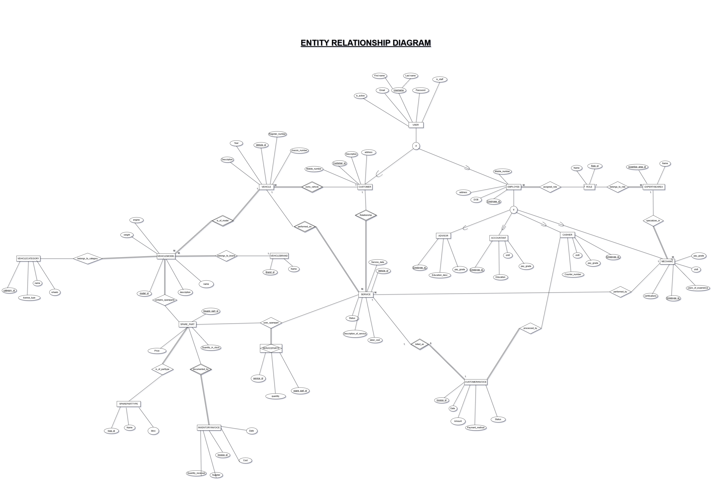
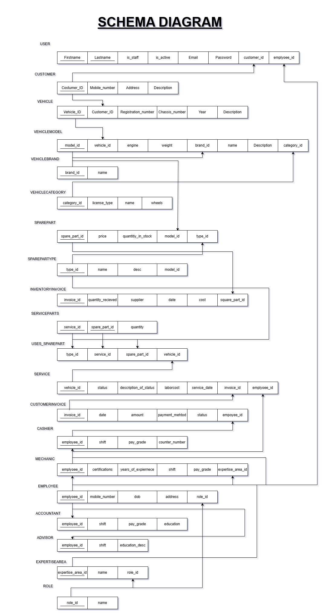

# Vehicle Service-Centre ERP Software (VSC_ERP)

**Authors**
- Lakshya Dubey (2024BCS0339)
- Armaan Z. Hussain (2024BCS0323)
- Jai Visvas Varshan (2024BCD0075)

**Date**
- 22-10-25

**Deadline**
- 04-11-25

## Ideal Objectives (Sub-Applications)

### Employee (Feasible)
Handling of all the employees that will exist on the system varying from Admin, Billing, Sales, Mechanics to janitors. Their contribution in the service/system.

### Inventory
Handling incoming shipments(parts) and keeping their track record and all their related sub actions.

### Customer (Feasible)
Handling customer data involving their previous services, personal record, vehicle record, loyalty points etc.

### Service (Feasible)
Each interaction between a customer and the Service Centre will be co-ordinated by this sub-application

### Billing 
Generating invoices for services, releasing of funds for inventory, salary, office's running costs, etc. shall be handled by this sub-application.

## Entity Relationship Diagram



## Schema Diagram



## Expected Entities

### 1. User
- username
- first_name
- last_name
- email
- password
- is_staff
- is_active

### 1A. Employee

- User (OneToOne)
- role (ForeignKey)
- DOB
- Address
- Mobile Number

### 1A1. Mechanic

- Employee (OneToOne)
- expertise_area (ForeignKey)
- Years of Experience
- shift
- certifications
- pay-grade

### 1A2. Accountant

- Employee (OneToOne)
- Education
- shift
- pay-grade

### 1A3. Cashier

- Employee (OneToOne)
- Counter Number
- shift
- pay-grade

### 1A4. Advisor

- Employee (OneToOne)
- Education desc
- pay-grade

### 1B. Customer

- User (OneToOne)
- Mobile Number
- Address
- Description (from staff)

### 2. Vehicle

- customer (ForeignKey)
- registration_number
- chassis_number (max_len 17)
- model (ForeignKey to `VehicleModel`)
- year
- description

### 3. Service

- **customer** (ForeignKey)
- **vehicle** (ForeignKey)
- **mechanic** (ForeignKey)
- service_parts (through table: `ServiceParts`)
- status
- description_of_service
- labor_cost
- service_date

### 4. SparePart

- **vehicle_model** (ForeignKey)
- **type** (foreignKey)
- quantity_in_stock
- price

### 5. InventoryInvoice

- spare_part (ForeignKey)
- supplier
- quantity_received
- date
- cost

### 6. CustomerInvoice

- service (ForeignKey)
- cashier (ForeignKey)
- date
- amount
- payment_method
- status

## Masters

#### 1. Role

- name

#### 2. Expertise Area

- name

#### 3. VehicleCategory

- name
- licence_type
- wheels

#### 4. VehicleBrand

- name

#### 5. VehicleModel

- brand (ForeignKey to `VehicleBrand`)
- category (ForeignKey to `VehicleCategory`)
- engine
- weight
- name
- description

#### 6. ServiceParts

- service (ForeignKey)
- spare_part (ForeignKey)
- quantity

### 7. Spare parts Type
- name
- desc


```bash
PS C:\Users\Lakshya\Documents\Codes\django\VSC_ERP> python manage.py makemigrations
Migrations for 'Masters':
  Masters\migrations\0001_initial.py
    + Create model MASTER_role
    + Create model MASTER_spare_part_type
    + Create model MASTER_vehicle_brand
    + Create model MASTER_vehicle_category
    + Create model MASTER_expertise_area
    + Create model MASTER_pay_grade_level
    + Create model MASTER_vehicle_model
Migrations for 'CORE':
  CORE\migrations\0001_initial.py
    + Create model Employee
    + Create model Customer
    + Create model Accountant
    + Create model Advisor
    + Create model Cashier
    + Create model Mechanic
    + Create model Service
    + Create model SparePart
    + Create model ServicePart
    + Add field parts to service
    + Create model InventoryInvoice
    + Create model Vehicle
    + Add field vehicle to service
    + Create model ServiceInvoice
    + Add field mechanic to service
PS C:\Users\Lakshya\Documents\Codes\django\VSC_ERP> python manage.py migrate
Operations to perform:
  Apply all migrations: CORE, Masters, admin, auth, contenttypes, sessions
Running migrations:
  Applying contenttypes.0001_initial... OK
  Applying contenttypes.0002_remove_content_type_name... OK
  Applying auth.0001_initial... OK
  Applying auth.0002_alter_permission_name_max_length... OK
  Applying auth.0003_alter_user_email_max_length... OK
  Applying auth.0004_alter_user_username_opts... OK
  Applying auth.0005_alter_user_last_login_null... OK
  Applying auth.0006_require_contenttypes_0002... OK
  Applying auth.0007_alter_validators_add_error_messages... OK
  Applying auth.0008_alter_user_username_max_length... OK
  Applying auth.0009_alter_user_last_name_max_length... OK
  Applying auth.0010_alter_group_name_max_length... OK
  Applying auth.0011_update_proxy_permissions... OK
  Applying auth.0012_alter_user_first_name_max_length... OK
  Applying Masters.0001_initial... OK
  Applying CORE.0001_initial... OK
  Applying admin.0001_initial... OK
  Applying admin.0002_logentry_remove_auto_add... OK
  Applying admin.0003_logentry_add_action_flag_choices... OK
  Applying sessions.0001_initial... OK
```